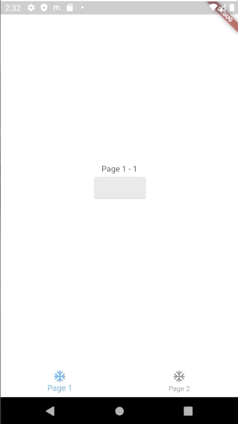

# bottommultinavigationbar

A widget where each fragment has their own navigation history inside the bottom navigation bar

## Getting Started

### 1. import bottommultinavigationbar

```dart 
import 'package:bottommultinavigationbar/bottommultinavigationbar.dart';
```

### 2. Create a list of PageNavigators:

```dart 
var pages = [
  PageNavigator(
    bottomNavigationIcon: Icon(Icons.ac_unit),
    bottomNavigationText: "Page 1",
    initialRoute: "/page2",
    onGenerateRoute: (settings) {
      if(settings.name == PageNavigator.home)
        return MaterialPageRoute(builder: (_) => Test(test:"Page 1 - 1",index: 0,));
      if(settings.name == "/page2")
        return MaterialPageRoute(builder: (_) => Test(test:"Page 1 - 2",index: 0));
    }
  ),
  PageNavigator(
    bottomNavigationIcon: Icon(Icons.ac_unit),
    bottomNavigationText: "Page 2",
    onGenerateRoute: (settings) {
      if(settings.name == PageNavigator.home)
        return MaterialPageRoute(builder: (_) => Test(test:"Page 2 - 1",index: 1,));
      if(settings.name == "/page2-2")
        return MaterialPageRoute(builder: (_) => Test(test:"Page 2 - 2",index: 1,));
    }
  ),
];
```

Be sure that you use "/" in your namings like "/page1". PageNavigator.home represents the home page of the fragment. From there the navigator will navigate to your pages inside of the fragment without leaving the bottom navigation view. With the "initialRoute" attribute you can specify a different start point for each of your fragment.

### 3. Use the BottomMultiNavigationBar Widget

```dart
  @override
  Widget build(BuildContext context) {
    return BottomMultiNavigationBar(
      index: myCounter
      pageNavigators: pages,
      onIndexChanged: (index) {
        setState({
          myCounter = index
        })
      },
    );
  }
```

### 4. Navigate

You can use the Navigator.of(context).pushNamed() as usual

```dart
    Navigator.of(context).pushNamed("/page2") 
```

With passing data:

```dart
    //push your data
    Navigator.of(context).pushNamed("/page2-2",arguments: "Test data")

    //in your PageNavigator
    PageNavigator(
      bottomNavigationIcon: Icon(Icons.ac_unit),
      bottomNavigationText: "Page 2",
      onGenerateRoute: (settings) {
        if(settings.name == PageNavigator.home)
          return MaterialPageRoute(builder: (_) => Test(test: "page2-1",index: 1,));
        if(settings.name == "/page2-2")
          if(settings.arguments is String)
            return MaterialPageRoute(builder: (_) => Test(test: settings.arguments,index: 1,));
          //else error handling
    }
  ),
```

## Using the FlutterIntent navigation system

This system is especially developed for this package and imitates the intent system of the Android Framework. Please
be aware that you use only one of the provided navigation system. So if you want to use the onGenerateRoute attribute the flutterIntentService has to be null and vice versa.

### 1. Use the flutterIntentService attribute of the PageNavigator class

```dart
PageNavigator(
    bottomNavigationIcon: Icon(Icons.ac_unit),
    bottomNavigationText: "Page 1",
    flutterIntentService: FlutterIntentService(
      onIntent: (intent) {
      if(intent.name == "/")
        return Test(name: intent.getStringExtra("str_page_name"));
      if(intent.name == "/page2")
        //we now that we get a boolean 
        return TestBool(isTrue: intent.getBoolExtra("bool_value"));
      }
    )
  ),
```

The intent which is passed as parameter holds the data. From there you can get your data like in the example above.

### 2. Send an intent

For sending an intent use the FlutterIntent() class:

```dart 
FlutterIntent(context: context,name: "/page2")
..putExtra("bool_value",true)
..startActivity();
```

Don't forget to call the startActivity in the end. This will start the next activity and pass your data to the next page which you defined in the PageNavigator in step 1.

### Example

